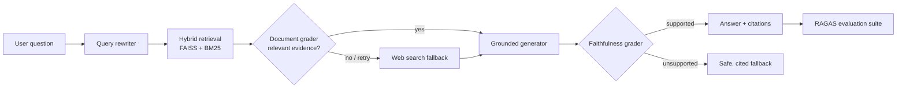

# SentinelRAG — Self-Corrective Agentic RAG

An evaluation-first Retrieval-Augmented Generation system that validates retrieved evidence, rewrites weak queries, optionally falls back to web search, and refuses unsupported claims.

> Built as a portfolio-quality reference for agentic AI, evaluation workflows, and pragmatic MLOps.



## Why this is different

Basic RAG answers from whatever is retrieved. SentinelRAG makes retrieval quality and grounding explicit, observable decisions:

- **Corrective routing:** relevance scoring decides whether to generate, rewrite, or search the web.
- **Hybrid retrieval:** dense vector search is blended with lexical BM25 for technical terms and identifiers.
- **Faithfulness gate:** answers that cite no supporting context are replaced with a transparent fallback.
- **Continuous evaluation:** RAGAS-compatible benchmark records context precision, faithfulness, and answer relevance.
- **Engineering hygiene:** typed state, unit tests, Docker, CI, structured trace output, and secrets-free configuration.

## Quickstart

```bash
cp .env.example .env
# Add OPENAI_API_KEY to .env for production LLM grading/generation.
docker compose -f docker/docker-compose.yml up --build
```

Open `http://localhost:8501`. The deterministic local mode works without an API key so that the system and tests are easy to inspect.

### Local development

```bash
python -m venv .venv && source .venv/bin/activate
pip install -r requirements.txt
streamlit run app/ui/streamlit_app.py
pytest -q
python -m app.evaluation.run_benchmark
```

## Repository layout

```text
app/
  core/         # graph, retrieval, graders, generator, models
  evaluation/   # reproducible benchmark and RAGAS adapter
  ui/           # Streamlit evidence-first UI
data/knowledge/ # example corpus; replace with your own domain material
tests/          # fast, offline unit tests
docker/         # container and compose setup
docs/           # architecture and benchmark guidance
```

## Evaluation

`python -m app.evaluation.run_benchmark` evaluates the included fixture set and writes `artifacts/benchmark.json`. With `RAGAS_ENABLED=true`, the adapter also calculates RAGAS metrics (credentials/dependencies required); otherwise it emits deterministic proxy metrics for CI.

Do not invent portfolio numbers. Run the benchmark against your chosen corpus, then replace the table below with the artifact values.

| Metric | Baseline RAG | Self-corrective RAG |
| --- | ---: | ---: |
| Context precision | Measure locally | Measure locally |
| Faithfulness | Measure locally | Measure locally |
| Answer relevance | Measure locally | Measure locally |

## Configuration

| Variable | Purpose |
| --- | --- |
| `OPENAI_API_KEY` | Enables OpenAI generation and LLM-as-a-judge grading |
| `OPENAI_MODEL` | Defaults to `gpt-4o-mini` |
| `TAVILY_API_KEY` | Enables live web-search fallback (otherwise a transparent no-web fallback is used) |
| `RELEVANCE_THRESHOLD` | Minimum evidence score (default `0.35`) |
| `RAGAS_ENABLED` | Run optional RAGAS metrics locally |

## Portfolio demo script (15 seconds)

1. Ask a precise corpus question and open the trace to show the `generate` route.
2. Ask an ambiguous or out-of-corpus question and show the `web_search` route.
3. Point out evidence citations, relevance score, and faithfulness gate.
4. End on `artifacts/benchmark.json` and the GitHub Actions check.

## Safety note

This is a grounding-oriented assistant, not a source of medical, legal, or financial advice. A high confidence score means the answer is supported by the supplied evidence; it does not establish real-world truth.
